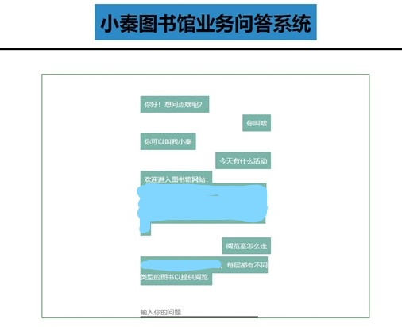

# Simple-Chatbot

This is a super simple chatbot(Mandarin). Include basic QA and business QA in university library(dataset removed).

Include QA log, database, naive bayes classifier.

## Dependencies for Running Locally

* Python >= 3.7
* Aiml == 0.9.2
* Flask == 1.1.2
* Jieba == 0.42.1
* Pandas == 1.0.3
* Scikit-learn == 0.20.3

## Basic Build Instructions

1. Clone this repo in PyCharm.
2. Wait until all the package installed.
3. Run app.py

## File and Class Structure

* app.py Run the flask server
* classification.py Machine Learning classifier
* output.py output the answer base on the classification result
* db_fetch.py Database management part
* accurate.py get the accuracy

------

# 超级简陋聊天机器人

超级简陋的问答系统(?)。包含简单的聊天和图书馆业务问答（已去除数据集）

## 依赖库

* Python >= 3.7
* Aiml == 0.9.2
* Flask == 1.1.2
* Jieba == 0.42.1
* Pandas == 1.0.3
* Scikit-learn == 0.20.3

## 如何启动

1. Clone 到 PyCharm.
2. 等所有的包下载完
3. 运行 app.py

## File and Class Structure

* app.py 运行flask服务器
* classification.py 机器学习分类器
* output.py 根据分类结果拉取答案
* db_fetch.py 数据库管理CRUD相关（只有C D）
* accurate.py 获取分类器的准确率
